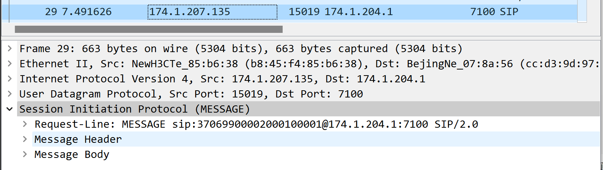
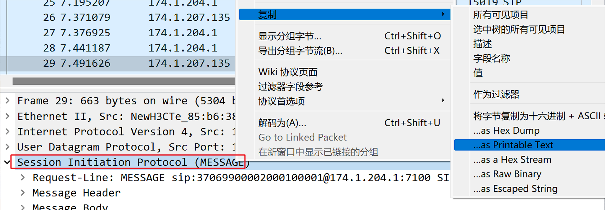
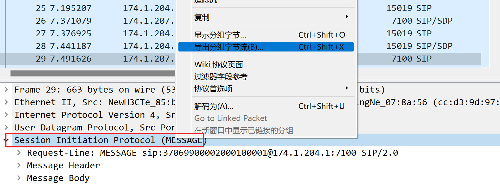
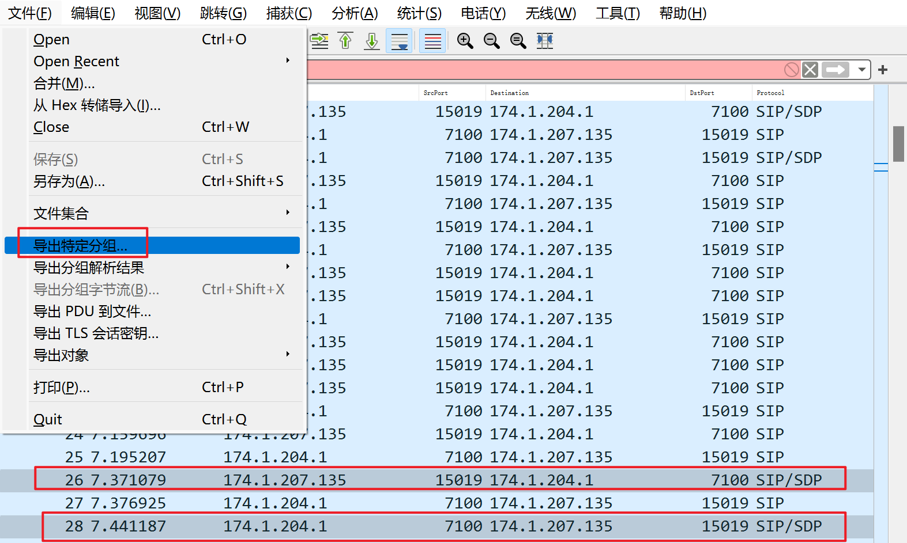
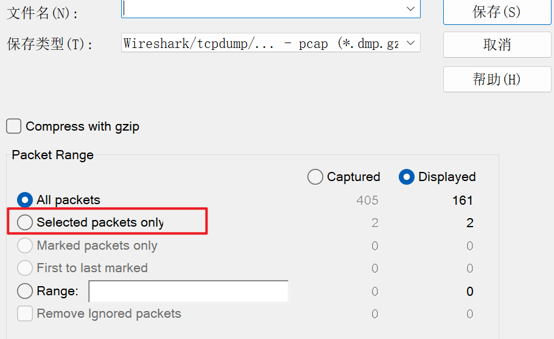

Wireshark是个非常强大的网络协议分析工具，可以帮助我们高效地分析、加工tcpdump抓取的抓包文件。
作为一个网络程序开发或测试人员，当你在为你的测试用例准备测试输入时，是否想过使用真实的网络抓包文件作为测试输入呢? 
但通常抓包文件都比较大，内容也非常杂乱，包含各种并非我们被测协议的报文。
本文站在网络开发与测试人员的角度来给大家介绍下如何使用Wireshark提取我们想要的数据。

1. 使用Wireshark提取抓包文件中的应用层数据

首先，我们从抓包文件中过滤出我们关注的报文，Wireshark的过滤规则非常
复杂，后面会单独讲解。



主要有以下三种方法：

## 1.1. 直接复制可打印文本

步骤： 选中要复制的节点 -> 复制 -> as Printable Text




这种方法比较适合文本类型的协议，如HTTP、FTP等，复制出的内容直接粘贴在文本文件或测试代码中即可。
不过，通常文本协议是以`\r\n`换行的，如果你是以`\n`换行的，就需要手工把`\r`补过来，所以还是最好保存为文件。
下面为复制出的内容：
```
MESSAGE sip:37069900002000100001@174.1.204.1:7100 SIP/2.0
Via: SIP/2.0/UDP 172.20.51.227:5060;branch=z9hG4bK-524287-1---c1293e78db6c9d78;rport
Max-Forwards: 70
Contact: <sip:37069900002000000010@174.1.207.131:15019>
To: <sip:37069900002000100001@174.1.204.1:7100>
From: <sip:37069900002000000010@174.1.207.131:15019>;tag=fd1f5e07
Call-ID: 5LBw2ZJPNKkt4XEHzz2onw..
CSeq: 1562647 MESSAGE
Content-Type: Application/MANSCDP+xml
Content-Length: 165

<?xml version="1.0" ?>
<Control>
 <CmdType>DeviceControl</CmdType>
 <SN>780132</SN>
 <DeviceID>37060109581314000015</DeviceID>
 <IFameCmd>Send</IFameCmd>
</Control>
```
## 1.2. 导出分组字节流

步骤：选中要到处的报文节点 -> 导出分组字节流。
或者使用快捷键(Ctrl+Shift+X)。



这个办法方便我们导出报文中的部分内容，如应用层部分，因为是以二进制方式转储，所以任何编码方案的协议都能导出。

## 1.3. 导出整个报文

步骤：选中一个或多个报文 -> 文件 -> 导出特定分组 -> 选择“Selected packets only”

默认导出的是所有显示中的报文，如果只是想导出个别报文，要选下“Selected packtes only”。

如果要导出的报文离得比较远，还可以先对要导出的报文进行标记，在导出对话框中选择你之前标记的报文，或者直接输入要导出报文的编号。



